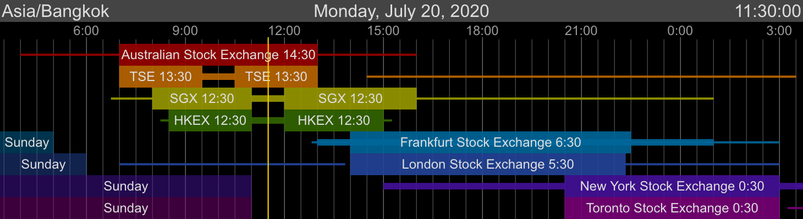

## ExchangeTimeWeb&nbsp;&nbsp;

***A web application that displays a timeline indicating periods when financial exchanges are open.***
- the gold vertical line represents the current time
- **zoom the timeline** using the mouse wheel or +/- keys
- edit the file "data.json" to modify timeline data and add holidays
- dependencies: https://moment.github.io/luxon

